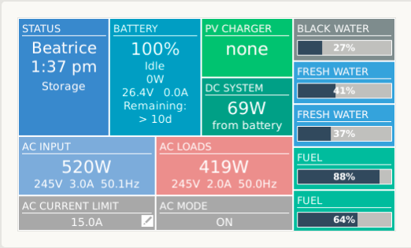

# venus-signalk-tank-service

__venus-signalk-tank-service__ provides a mechanism for injecting
tank data from Signal K onto the Venus OS dbus, enabling the display
of such data on Venus OS devices like the Victron CCGX.

This is useful because it provides a work-around for Venus' broken
native support for multi-channel tank sensor devices like the
Maretron FPM100 and the Garnet SeeLevel. 

Although designed to address Venus' multi-channel support issue, the
project will, of course, inject any Signal K tank data into Venus
and so make it renderable on a Venus display.



## Background

Support for tank monitoring in Venus OS is fundamentally broken.
The low-level code implementing CAN/N2K tank data recovery assumes
one tank sensor device per physical tank and generates a dbus
tank service besed on this assumption.

For multi-channel tank sensor devices Venus discards individual
tank sensor instance numbers and consolidates data from all tank
sensors under the tank device instance number, leading to a single
dbus tank service delivering data from multiple tanks.

The absence of any tank sensor instance numbers means that
disaggregation of the composite data is at best problematic and, for
non-trivial tank installations, infeasible.

Even so, there have been a number of attempts at implementing fixes
and work-arounds in Venus.
Mostly these rely on the spurious association of fluid type and tank
level which only allows the disaggregation of the composite data if
one allows no more than one tank of any fluid type.

## This project

__venus-signalk-tank-service__ ignores Venus' broken tank handling,
and instead recovers tank data from a Signal K server, generating
and updating one dbus service per tank.
Once the data is on dbus it becomes available to Venus in a way that
can be picked up and rendered by a CCGX or similar display.

Data is recovered from Signal K over HTTP and the Signal K server can
be running on the local network or even on the Venus host.

For many multi-tank installations the default Venus GUI doesn't quite
make it - the size of individual tank panel elements limits the number
of tanks that can be displayed.
@kwindrem has impemented some GUI updates that address this problem
in his
[tank repeater](https://github.com/kwindrem/SeeLevel-N2K-Victron-VenusOS)
project and the following installation instructions assume that you
will want to update your system in this way.

### Installation

1. If you are installing on a CCGX, make sure that root access is
   enabled.
   
2. Install @kwindrem's
   [tank repeater](https://github.com/kwindrem/SeeLevel-N2K-Victron-VenusOS).
   
   When you run the repeater project setup script, respond to the
   first prompt with 'a' (Activate) and subsequent prompts with 'y'.
   This will activate @kwindrem's repeater (we don't need this) and
   install his GUI changes (we do need these).
   
   Run the repeater project setup script again, responding to the
   first prompt with 'd' (Disable) and subsequent prompts with 'y'.
   This will disable @kwindrem's repeater, but leave his GUI changes
   in place.
   
3. Install __venus-signalk-tank-service__ by logging into your Venus
   device and issuing the following commands.
   ```
   $> cd /data
   $> wget wget https://github.com/preeve9534/venus-signalk-tank-service/archive/main.tar.gz
   $> tar -xzf main.tar.gz
   $> rm main.tar.gz
   $> cd venus-signalk-tank-service-main
   ```

4. Open ```signalktankservice.py``` in a text editor and change the
   values of SIGNALK_SERVER and SIGNALK_TANKS to suit your needs.

   SIGNALK_SERVER should specify the hostname/IP address and port
   number of your Signal K server.
   Use ```SIGNALK_SERVER = '127.0.0.1:3000'``` if Signal K is
   running on its defaultt port on the Venus host.
   
   If you set ```SIGNALK_TANKS = []``` then all the tanks available
   on SIGNALK_HOST will be automatically recovered.
   Alternatively, you can specify particular tanks via their 'self'
   relative Signal K path.
   For example:
   ```
   SIGNALK_TANKS = [
        { 'path': 'tanks/wasteWater/0' },
        { 'path': 'tanks/freshWater/1' },
        { 'path': 'tanks/freshWater/2' },
        { 'path': 'tanks/fuel/3' },
        { 'path': 'tanks/fuel/4' }
   ]
   ```

5. Run ```signalktankservice.py``` and check that it outputs details of
   the tanks it is configuring. My system has five tanks and I see:
   ```
   $> ./signalktankservice.py 
   INFO:root:registered ourselves on D-Bus as com.victronenergy.tank.signalk_tank_0
   INFO:root:registered ourselves on D-Bus as com.victronenergy.tank.signalk_tank_1
   INFO:root:registered ourselves on D-Bus as com.victronenergy.tank.signalk_tank_2
   INFO:root:registered ourselves on D-Bus as com.victronenergy.tank.signalk_tank_3
   INFO:root:registered ourselves on D-Bus as com.victronenergy.tank.signalk_tank_4
   ```
   If the output isn't what you expect, then check the tank data
   is actually available in Signal K and make sure that the values
   you supplied for SIGNALK_SERVER and SIGNALK_TANKS are correct.

6. With ```signalktankservice.py``` running you should see your
   configured tanks displaying on the Venus GUI.
   Stop the program using 'ctrl-C'.

7. Run ```setup``` to make ```signalktankservice.py``` execute
   automatically when Venus boots.
   ```
   $> ./setup
   ```
   This script simply adds a line to ```/data/rc.local``` (creating the file if it
   is absent) which launches ```signalktankservice.py``` when Venus reboots.
   This change persists over OS updates.
   
8. Finally, reboot Venus.
   ```
   $> reboot
   ```

## Acknowledgements

Thanks to @kwindrem for making this a whole lot easier than it might have
been by designing his repeater software in a way which meant I could
leverage it.

Thanks to @mvader at Victron for being honest about the likelihood of a
manufacturer fix and and so motivating me (after four years of complaining!)
to take a different approach to getting tank data on my CCGX.

## Author

Paul Reeve \<<preeve@pdjr.eu>\>
